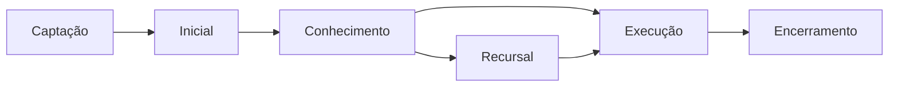

# 📋 Fases e Andamentos de Processos Trabalhistas

Este documento mapeia as fases típicas de um processo trabalhista e seus andamentos correspondentes.
Serve como diretriz para futuras implementações de automação e rastreamento de processos.

---

## 1️⃣ Fase: Captação e Análise (Pré-processual)

**Descrição:** Status internos do escritório, antes mesmo de existir um processo judicial.

### Andamentos Possíveis:

- **Novo Contato (Lead):** O cliente procurou o escritório, mas ainda não foi entrevistado.
- **Aguardando Agendamento:** Contatado, esperando data para reunião.
- **Aguardando Documentos do Cliente:** Reunião realizada, aguardando documentos essenciais (RG, CTPS, Contrato, etc.).
- **Em Análise de Viabilidade:** Advogado está analisando o caso e os documentos.
- **Aguardando Proposta:** Viabilidade OK, aguardando envio/resposta da proposta de honorários.
- **Aguardando Contrato/Procuração:** Cliente aceitou, aguardando assinaturas.
- **Não Contratado (Perdido):** Cliente não aceitou a proposta ou o caso era inviável.
- **Contratado (A Preparar):** Documentação assinada. Pronto para a próxima fase.

---

## 2️⃣ Fase: Tentativa Extrajudicial e Inicial

**Descrição:** O processo está sendo preparado ou em negociação prévia.

### Andamentos Possíveis:

- **Em Negociação Extrajudicial:** Contatando a parte contrária para acordo antes da ação.
- **Em Elaboração de Petição Inicial:** Advogado está redigindo a petição.
- **Aguardando Distribuição/Protocolo:** Petição pronta, aguardando o ato de protocolar no sistema do tribunal.
- **Processo Distribuído (Aguardando Citação):** Protocolado. Aguardando o tribunal marcar a audiência e/ou notificar a outra parte.

---

## 3️⃣ Fase: Conhecimento (Instrução)

**Descrição:** Fase mais longa, onde o juiz vai "conhecer" os fatos para poder julgar.

### Andamentos Possíveis:

- **Aguardando Audiência (Inicial/Conciliação):** Data da primeira audiência marcada.
- **Aguardando Prazo (Geral):** Termo genérico para quando o processo espera um prazo que não é seu (ex: prazo da outra parte).
- **Aguardando Prazo (Contestação/Réplica):** Esperando a defesa da empresa ou o seu prazo para responder à defesa.
- **Aguardando Audiência (Instrução):** Data marcada para ouvir testemunhas e partes.
- **Aguardando Perícia:** Processo aguardando a nomeação de um perito (ex: médico, engenheiro).
- **Aguardando Laudo Pericial:** Perito nomeado, aguardando a entrega do laudo técnico.
- **Prazo: Manifestação sobre Laudo:** Prazo correndo para você (ou a outra parte) falar sobre o laudo do perito.
- **Processo Suspenso:** Ocorreu algo que "pausou" o processo (ex: negociação de acordo, morte de uma parte, etc.).
- **Concluso para Despacho:** O processo está na mesa do juiz para uma decisão simples (ex: marcar data, pedir um documento).
- **Concluso para Decisão:** O juiz vai dar uma decisão intermediária (ex: sobre a perícia, sobre uma liminar).
- **Concluso para Sentença:** O processo está pronto (instruído) e na mesa do juiz para a decisão final da 1ª instância.
- **Sentença Publicada (Aguardando Prazo):** A sentença saiu. Aguardando o prazo para recurso.

---

## 4️⃣ Fase: Recursal (Tribunal - TRT / TJ)

**Descrição:** A parte que perdeu não concordou com a sentença e recorreu.

### Andamentos Possíveis:

- **Em Elaboração de Recurso:** Seu prazo para recorrer da sentença.
- **Em Elaboração de Contrarrazões:** A outra parte recorreu, e você está respondendo ao recurso dela.
- **Aguardando Admissibilidade:** O juiz de 1ª instância analisa se o recurso cumpre os requisitos para "subir" ao tribunal.
- **Remetido ao Tribunal (TRT/TJ):** O processo saiu da 1ª instância e foi para a 2ª (Tribunal).
- **Aguardando Distribuição (Tribunal):** Esperando o processo ser sorteado para um Desembargador (Relator).
- **Concluso para Relator:** O processo está na mesa do Desembargador Relator para análise.
- **Aguardando Pauta de Julgamento:** O Relator já analisou, e o processo está na fila para ser julgado pelo grupo de Desembargadores.
- **Julgamento Agendado (Sessão Virtual/Presencial):** Data marcada para o julgamento no Tribunal.
- **Acórdão Publicado (Aguardando Prazo):** A decisão do Tribunal (Acórdão) saiu. Aguardando prazo para novos recursos (ex: Brasília - TST/STJ).
- **Aguardando Trânsito em Julgado:** Todas as partes foram intimadas do Acórdão e não há mais recursos pendentes.
- **Processo Baixado (Retorno à Origem):** O processo foi julgado no Tribunal e está voltando para a 1ª instância para começar a Execução.

---

## 5️⃣ Fase: Execução (Liquidação e Pagamento)

**Descrição:** O processo acabou, já há um vencedor, e agora é a fase de calcular e receber os valores.

### Andamentos Possíveis:

- **Aguardando Início da Execução:** Processo de volta na 1ª instância, aguardando o vencedor pedir o início dos cálculos.
- **Em Fase de Liquidação (Cálculos):** Fase de elaboração das planilhas para saber o valor exato.
- **Aguardando Impugnação de Cálculos:** Uma das partes apresentou os cálculos, e a outra parte tem prazo para concordar ou discordar.
- **Cálculos Homologados (Aguardando Pagamento):** O juiz definiu o valor final e mandou a empresa pagar.
- **Aguardando Pagamento Voluntário:** Prazo para a empresa depositar o valor sem necessidade de bloqueio.
- **Em Pesquisa Patrimonial (Bacen/SisbaJud):** A empresa não pagou. O juiz está buscando dinheiro nas contas bancárias dela.
- **Em Pesquisa de Bens (RenaJud / InfoJud):** Buscando carros ou outros bens em nome da empresa.
- **Aguardando Leilão/Hasta Pública:** Um bem foi penhorado e será leiloado para pagar a dívida.
- **Valor Depositado (Aguardando Liberação):** O dinheiro (seja por pagamento ou bloqueio) está na conta judicial.
- **Expedição de Alvará / Guia de Retirada:** O juiz liberou o dinheiro. Aguardando o documento para sacar.

---

## 6️⃣ Fase: Encerramento (Pós-Pagamento)

**Descrição:** O cliente recebeu, o processo está sendo finalizado.

### Andamentos Possíveis:

- **Valor Recebido (Em Prestação de Contas):** O escritório sacou o valor e está preparando a prestação de contas ao cliente (descontando honorários).
- **Pagamento Realizado ao Cliente:** Cliente recebeu sua parte.
- **Aguardando Arquivamento Definitivo:** O processo está pago e "limpo", apenas aguardando o cartório arquivá-lo oficialmente.
- **Arquivado Definitivamente:** O processo foi encerrado e "baixado" no sistema.

---

## 🎯 Implementações Futuras Sugeridas

### 1. **Automação de Detecção de Fase**
```sql
-- Adicionar coluna de fase nos processos
ALTER TABLE processos ADD COLUMN fase VARCHAR(50);
ALTER TABLE processos ADD COLUMN andamento_atual VARCHAR(100);

-- Índice para performance
CREATE INDEX idx_processos_fase ON processos(fase);
CREATE INDEX idx_processos_andamento ON processos(andamento_atual);
```

### 2. **Dashboard de Pipeline**
- Visualização Kanban por fase
- Contadores automáticos por fase
- Alertas de processos parados há muito tempo em uma fase

### 3. **Automação de Prazos**
- Criar prazos automáticos baseados no andamento
- Ex: "Sentença Publicada" → Criar prazo fatal de 15 dias para recurso

### 4. **Relatórios de Produtividade**
- Tempo médio por fase
- Gargalos (fases com maior tempo de permanência)
- Taxa de conversão por fase

### 5. **Integração com DataJus**
- Mapear movimentações do PJe para andamentos internos
- Atualização automática de fase baseada em movimentações

### 6. **Notificações Inteligentes**
```javascript
// Exemplo de regra de notificação
if (andamento === 'Concluso para Sentença' && diasNaFase > 90) {
  criarNotificacao({
    tipo: 'alerta',
    prioridade: 'alta',
    mensagem: 'Processo há 90+ dias concluso para sentença'
  });
}
```

---

## 📊 Estrutura de Dados Sugerida

```typescript
interface Fase {
  id: number;
  nome: string;
  ordem: number; // 1-6
  cor: string; // Para visualização
  icone: string;
}

interface Andamento {
  id: number;
  nome: string;
  fase_id: number;
  gera_prazo: boolean;
  dias_prazo?: number;
  tipo_prazo?: 'Fatal' | 'Comum' | 'Dilatório';
  proximos_andamentos_possiveis: number[]; // IDs de andamentos subsequentes
}

interface ProcessoHistoricoFase {
  id: number;
  processo_id: number;
  fase_id: number;
  andamento_id: number;
  data_inicio: Date;
  data_fim?: Date;
  observacoes?: string;
}
```

---

## 🔄 Fluxo de Transição Automática



---

**Status:** 📝 Documento em construção - Será expandido conforme necessário

**Última atualização:** 03/11/2025
